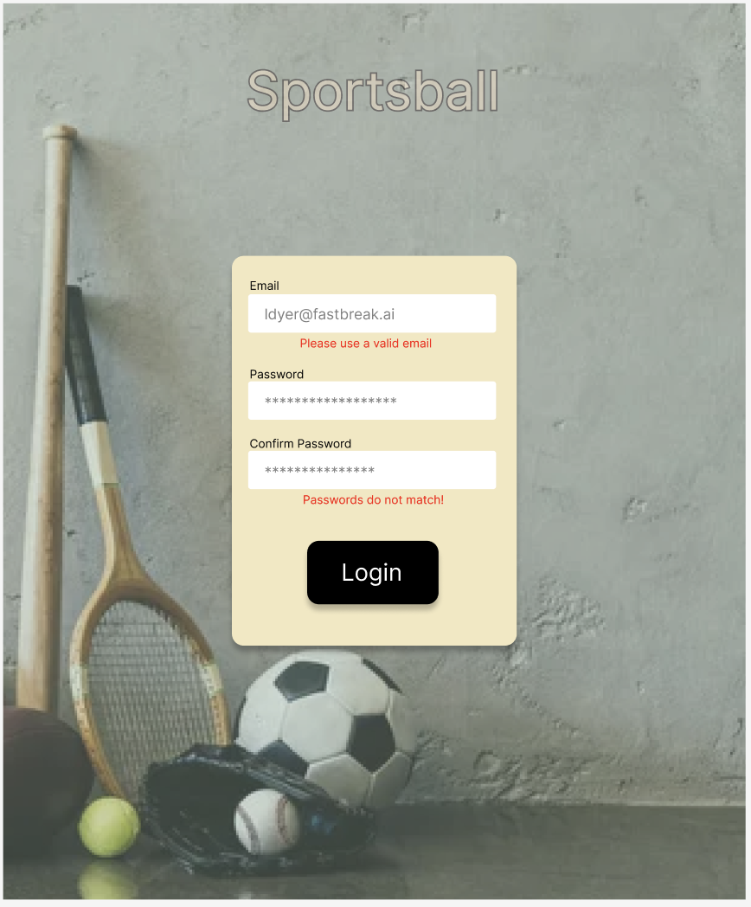
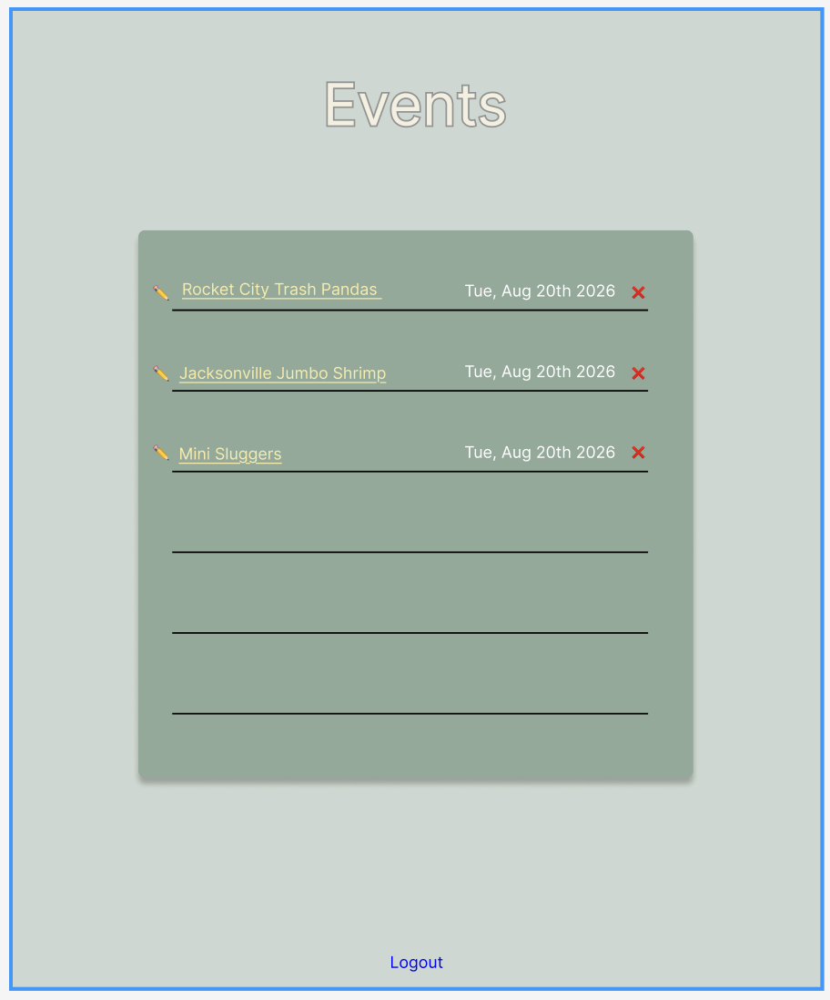

Sportball - All your sports in one place.

Built with Next.js, Tailwind, React, Supabase, and Shadcn.


Notes in progress:

- `lib/supabase/` handles every call to supabase using a server side client which is re-created for each fetch [per their documentation](https://supabase.com/docs/guides/auth/server-side/creating-a-client?queryGroups=environment&environment=middleware) and utilizes the proxy (middleware) to intercept and validate each call with JWT tokens. I opted here to not even include the client.ts for browser side fetching as the instructions were to use actions and api/ routes instead.

- Enabled Row Level Security knowing it would take more time to set up, but by default be way more secure. I've used this in the past and remember it giving me trouble, but ultimately worth the work. Basically IAM roles built in to supabase I think. Need permission to access each row ? ? ? will have to come back after I've implemented it.

- Also enabled real time subscription though I'm less sure of this it seems like what I'd expect from a db: instant changes reflected.

- Included timezone in events => increases complexity but also ensures less bugs... In form I'll need to collect
  - date, start time, end time, and timezone
  - combine them all together to create the timestampz type required prior to sending to supabase

Event DML
    id: primary
    created_at: auto timestamp
    venue: string
    time_start: timestampz
    time_end: timestampz
    activity: enum // as in which sport, but also left open to be any kind of event (meet and greet with pro athelete etc...)

    should I make table of venues? I think not for now - if I can get through the rest I may specify which venues and use an id to reference. I did make activity an Enum "Pickleball" | "Tennis" | "Basketball" | "Soccer" (sorry football got lazy)

    To make the enum used the sql editor:

    ```SQL
    CREATE TYPE activity AS ENUM('Soccer', 'Basketball', 'Tennis', 'Pickleball')
    ```
 

 To access the rls for events a wide open SELECT sql statement:
```SQL
CREATE POLICY "allow all" ON events
FOR SELECT USING (true);
```


- Before I even bothered styling, used figma to create a mockup for the two pages:



I have the login form working to a degree - supabase auth handles encryption and auth.user table automatically. But I have a confirm password field that should only show up on the sign up page not on a general log in. Also - I confirmed my email from supabase, but still not logging in properly... need to fix auth LOGIN and redirect

A lot of issues with auth - because I was attemptint to use both next.js AND supabase auth (forgot I started with next and switched to supabase) so the proxy was fighting me. Working well now with both Sign In and Log in page that are using shared utils and "Check Email" card for email validation.